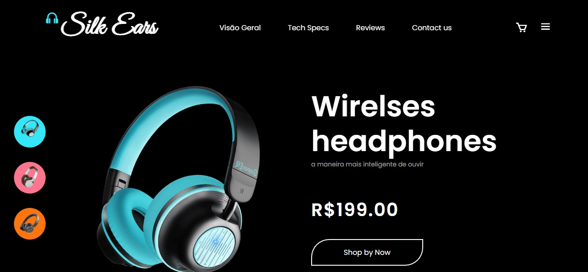

<h1 align="center"> Silk Ears</h1>

Projeto de treino.  
<a href="hhttps://www.youtube.com/watch?v=2QW9SNCjFVU">Estude esse projeto em formato de vídeo clicando aqui.</a>

  <a href="#-tecnologias">Tecnologias</a>&nbsp;&nbsp;&nbsp;|&nbsp;&nbsp;&nbsp;
  <a href="#-projeto">Projeto</a>&nbsp;&nbsp;&nbsp;|&nbsp;&nbsp;&nbsp;
  <a href="#-layout">Layout</a>&nbsp;&nbsp;&nbsp;|&nbsp;&nbsp;&nbsp;
  <a href="#memo-licença">Licença</a>

  

 

## 🚀 Tecnologias

Esse projeto foi desenvolvido com as seguintes tecnologias:

- HTML e CSS
- JavaScript
- Git e Github

## 💻 Projeto

Uma Landing Page, que simula uma página de vendas online.

- [Acesse o projeto finalizado, online](https://corsana-black.github.io/Fones-landing-page)

- [Assistia a outros tutoriais](https://www.youtube.com/@tahmidahmed-yt/videos)

## 📚 Aprendizado

Esse projeto me ajudou a enteder certas tecnicas principalmente no CSS para deixar o página responsiva, também aprendi que é preciso melhorar sempre por isso a tipografia da logo foi mudada e o estilo do botão de compra.

## :memo: Licença

Esse projeto está sob a licença MIT.

---

Feito com ♥ by Corsana Black🚀🚀🚀🚀🚀
